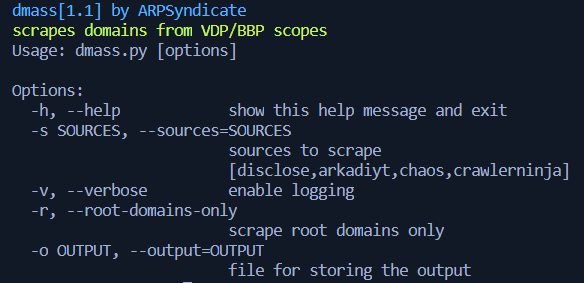

# Dmass | Scrapes domains from VDP/BBP Scopes [DEAD]

## Screenshots

## Instructions for running
1. Install requirements using `pip3 install -U -r requirements.txt`.
2. Run `python3 dmass.py -h`.  
3. `domains.txt` contains the latest scraped root domains.  

**COMPATIBILITY TESTED ON ARCHLINUX(x64), DEBIAN(x64) & WINDOWS10(x64) ONLY** 
**FEEL FREE TO SUBMIT PULL REQUESTS**
